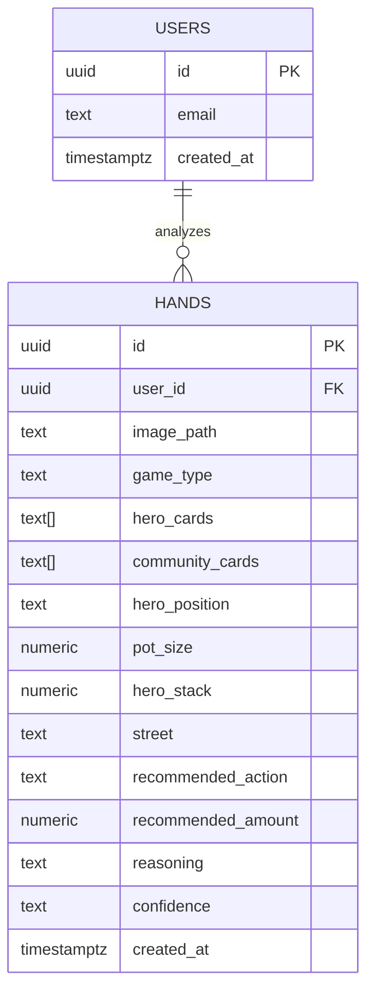

# Poker Assistant MVP

## Overview

An AI-powered poker study companion where users paste screenshots of their poker table and get instant strategic advice. Claude's vision API reads the game state (cards, positions, pot, actions) and streams back an action-first recommendation with expandable reasoning. Designed for learning on play-money tables.

**Target user:** Beginner poker player in Netherlands/EU who wants to learn poker strategy through real-time practice on play-money tables, eventually transitioning to profitable real-money play.

**Differentiator:** Screenshot-in, strategy-out. No manual data entry, no solver complexity, no installation. Paste a screenshot, get advice in 3 seconds.

## Problem Statement

Learning poker is hard. Existing tools are either:
- **Too complex** (PioSolver, GTO Wizard) — steep learning curve, designed for advanced players
- **Too passive** (strategy articles, videos) — no feedback on your actual hands
- **Too expensive** (coaching, HUD subscriptions) — $30-100/month for serious tools

There's no tool that lets a beginner paste a screenshot and get "RAISE to $50 — here's why" with a teaching explanation.

## Proposed Solution

A Next.js web app with four sections:

1. **Hand Analyzer** (core) — Paste screenshot, get instant advice
2. **Hand History** — Review past analyzed hands, track learning
3. **Strategy Library** — Curated poker strategy organized by skill level
4. **Platform Guide** — Where to play poker online (EU-focused recommendations)

## Technical Approach

### Architecture

```
app/
├── layout.tsx                    # Root layout (fonts, metadata, providers)
├── page.tsx                      # Landing page / hand analyzer
├── globals.css                   # Tailwind globals
├── (app)/                        # Protected route group
│   ├── layout.tsx                # App layout with nav
│   ├── analyzer/page.tsx         # Hand analyzer (core feature)
│   ├── history/page.tsx          # Hand history list
│   ├── history/[id]/page.tsx     # Single hand detail
│   ├── strategy/page.tsx         # Strategy library index
│   ├── strategy/[slug]/page.tsx  # Strategy article
│   └── platforms/page.tsx        # Platform recommendations
├── (auth)/                       # Auth route group (no auth check)
│   ├── login/page.tsx            # Login page
│   └── signup/page.tsx           # Signup page
├── api/
│   └── analyze/route.ts          # POST: Screenshot analysis (streaming)
├── providers/
│   └── SupabaseProvider.tsx      # Supabase client provider
components/
├── analyzer/
│   ├── PasteZone.tsx             # Whole-page paste listener + drop zone
│   ├── AnalysisResult.tsx        # Action-first result display
│   ├── HandPreview.tsx           # Screenshot thumbnail
│   └── LoadingState.tsx          # Streaming loading animation
├── history/
│   ├── HandCard.tsx              # Hand history list item
│   └── HandDetail.tsx            # Full hand review
├── strategy/
│   └── ArticleCard.tsx           # Strategy article card
├── layout/
│   ├── Nav.tsx                   # Top navigation
│   └── Footer.tsx                # Footer with disclaimers
└── ui/                           # Shared UI primitives
lib/
├── supabase/
│   ├── server.ts                 # Server-side Supabase client
│   ├── client.ts                 # Browser Supabase client
│   └── middleware.ts             # Auth middleware helper
├── ai/
│   ├── analyze-hand.ts           # Claude vision analysis logic
│   └── system-prompt.ts          # Poker analysis system prompt
├── poker/
│   └── types.ts                  # Poker domain types (GameState, Action, etc.)
└── utils/
    ├── image.ts                  # Image resize/compress utilities
    └── paste.ts                  # Clipboard paste helpers
types/
├── supabase.ts                   # Generated Supabase types
└── index.ts                      # App-wide types
middleware.ts                     # Next.js middleware (auth routing)
```

### Database Schema

```sql
-- Users handled by Supabase Auth (auth.users)

-- Hand analysis history
CREATE TABLE hands (
  id UUID PRIMARY KEY DEFAULT gen_random_uuid(),
  user_id UUID NOT NULL REFERENCES auth.users(id) ON DELETE CASCADE,
  image_path TEXT NOT NULL,              -- Supabase Storage path
  game_type TEXT NOT NULL DEFAULT 'nlhe', -- 'nlhe' for MVP

  -- Parsed game state (from Claude vision)
  hero_cards TEXT[],                     -- e.g. ['Ah', 'Kd']
  community_cards TEXT[],               -- e.g. ['Qs', 'Jh', '10c']
  hero_position TEXT,                   -- e.g. 'BTN', 'BB', 'UTG'
  pot_size NUMERIC,
  hero_stack NUMERIC,
  street TEXT,                          -- 'preflop', 'flop', 'turn', 'river'

  -- Analysis result
  recommended_action TEXT NOT NULL,     -- 'FOLD', 'CALL', 'RAISE'
  recommended_amount NUMERIC,          -- For raises
  reasoning TEXT NOT NULL,             -- Full explanation
  confidence TEXT DEFAULT 'medium',    -- 'high', 'medium', 'low'

  -- Metadata
  created_at TIMESTAMPTZ DEFAULT now(),

  CONSTRAINT valid_action CHECK (recommended_action IN ('FOLD', 'CALL', 'RAISE', 'CHECK', 'BET'))
);

-- RLS: Users can only access their own hands
ALTER TABLE hands ENABLE ROW LEVEL SECURITY;

CREATE POLICY "Users read own hands" ON hands
  FOR SELECT USING (auth.uid() = user_id);

CREATE POLICY "Users insert own hands" ON hands
  FOR INSERT WITH CHECK (auth.uid() = user_id);

CREATE POLICY "Users delete own hands" ON hands
  FOR DELETE USING (auth.uid() = user_id);

-- Index for hand history queries
CREATE INDEX idx_hands_user_created ON hands (user_id, created_at DESC);

-- Supabase Storage bucket for screenshots
-- Created via Supabase dashboard or migration:
-- INSERT INTO storage.buckets (id, name, public) VALUES ('hand-screenshots', 'hand-screenshots', false);
```



### Key Technical Decisions

**Claude model:** `claude-sonnet-4-20250514` — best balance of speed, accuracy, and cost (~$0.005 per analysis). Upgrade to Opus for complex multi-street scenarios if needed.

**Streaming:** Vercel AI SDK (`ai` + `@ai-sdk/anthropic`) with `streamText()` and `useChat()`. Use structured tool output so the action (FOLD/CALL/RAISE) arrives as parseable JSON, while the reasoning streams as text.

**Image handling:** Client-side resize to max 1568px on longest edge (Claude's optimal resolution) before encoding as base64. Saves bandwidth and reduces token cost.

**Paste flow:**
1. `document.addEventListener('paste', ...)` on the entire page
2. Extract image from `clipboardData.items`
3. Resize client-side with canvas
4. Convert to base64
5. Send to `/api/analyze` route
6. Stream response back via SSE

**Auth strategy:**
- Anonymous users can analyze hands (rate limited: 5/day via localStorage counter)
- Authenticated users get 30/day and hand history saving
- Use Supabase Auth with magic link (email) — lowest friction for signup

**Screenshot storage:** Supabase Storage bucket `hand-screenshots`, private. Only stored for authenticated users when saving to history.

### System Prompt Design

The Claude vision system prompt needs to:
1. Parse the poker table screenshot into structured game state
2. Identify the user's hand, position, community cards, pot, stacks
3. Recommend an action with bet sizing
4. Explain the reasoning at a beginner-friendly level
5. Teach the relevant concept (e.g., "This is a good spot to continuation bet because...")

The prompt will be defined in `lib/ai/system-prompt.ts` and use tool calling to return structured data:

```typescript
// Structured output schema (Zod)
const pokerAnalysisSchema = z.object({
  // Parsed game state
  heroCards: z.array(z.string()).describe("Hero's hole cards, e.g. ['Ah', 'Kd']"),
  communityCards: z.array(z.string()).describe("Community cards on the board"),
  heroPosition: z.string().describe("Hero's position: UTG, MP, CO, BTN, SB, BB"),
  potSize: z.number().describe("Current pot size"),
  heroStack: z.number().describe("Hero's remaining stack"),
  street: z.enum(['preflop', 'flop', 'turn', 'river']),

  // Recommendation
  action: z.enum(['FOLD', 'CHECK', 'CALL', 'BET', 'RAISE']),
  amount: z.number().optional().describe("Bet/raise amount if applicable"),
  confidence: z.enum(['high', 'medium', 'low']),

  // Teaching
  reasoning: z.string().describe("Why this action is recommended (2-3 paragraphs, beginner-friendly)"),
  concept: z.string().describe("The poker concept being applied (e.g., 'Continuation Betting', 'Pot Odds')"),
  tip: z.string().describe("One actionable tip the player can remember"),
});
```

### Implementation Phases

#### Phase 1: Project Scaffold + Core Analyzer (Week 1)

**Goal:** Paste a screenshot, get a poker recommendation streamed back.

**Tasks:**
- [ ] Initialize Next.js project with `bunx create-next-app@latest`
  - TypeScript, Tailwind, App Router, no src directory
- [ ] Set up Supabase project (`bunx supabase init`)
- [ ] Copy `scripts/db.sh` from template
- [ ] Create `.env.local.example` with required env vars
- [ ] Create `CLAUDE.md` for the project
- [ ] Install dependencies: `ai`, `@ai-sdk/anthropic`, `@supabase/ssr`, `zod`
- [ ] Build `PasteZone.tsx` — whole-page paste listener
  - Listen for paste events on document
  - Extract image from clipboard
  - Show image preview
  - Client-side resize to 1568px max
  - Convert to base64
- [ ] Build `app/api/analyze/route.ts` — streaming analysis endpoint
  - Accept base64 image in POST body
  - Send to Claude via Vercel AI SDK with vision
  - Stream structured response back
  - Input validation (image size, format)
- [ ] Build `lib/ai/system-prompt.ts` — poker analysis prompt
  - Game state parsing instructions
  - Strategy advice calibrated for beginners
  - Structured output schema
- [ ] Build `lib/ai/analyze-hand.ts` — analysis orchestration
- [ ] Build `AnalysisResult.tsx` — action-first display
  - Big bold action badge (FOLD/CALL/RAISE + amount)
  - Streaming reasoning text below
  - Concept tag and tip callout
  - Screenshot thumbnail for verification
- [ ] Build `LoadingState.tsx` — analysis in progress
  - Skeleton loader matching result layout
  - "Analyzing your hand..." message
- [ ] Build `lib/utils/image.ts` — client-side image processing
  - Resize with canvas API
  - Format validation (PNG, JPEG, WebP)
  - Size limit check (5MB max)
- [ ] Build main page (`app/page.tsx`) — landing + analyzer
  - Hero section explaining the app
  - Paste zone as primary CTA
  - Analysis result display area
- [ ] Build error handling for common failures
  - Non-poker image ("This doesn't appear to be a poker table")
  - Unreadable screenshot ("The image is too blurry to analyze")
  - API timeout / failure (retry button)
  - Rate limit exceeded message

**Success criteria:** User can paste a poker table screenshot and see a streamed FOLD/CALL/RAISE recommendation with reasoning within 5 seconds.

#### Phase 2: Authentication + Hand History (Week 2)

**Goal:** Users can sign up, save analyzed hands, and review them later.

**Tasks:**
- [ ] Set up Supabase Auth with magic link
  - `lib/supabase/server.ts`, `client.ts`, `middleware.ts`
  - `middleware.ts` — protect `(app)` routes
- [ ] Build auth pages
  - `(auth)/login/page.tsx` — email + magic link
  - `(auth)/signup/page.tsx` — create account
  - Note: Keep outside `(app)` route group to avoid redirect loops
- [ ] Create database migration for `hands` table
  - Schema as defined above
  - RLS policies
  - Indexes
- [ ] Create Supabase Storage bucket `hand-screenshots`
  - Private bucket
  - RLS: users can upload/read their own screenshots
- [ ] Build save-to-history flow
  - After analysis completes, save button (or auto-save for auth users)
  - Upload screenshot to storage
  - Insert hand record with parsed state + analysis
- [ ] Build hand history page (`(app)/history/page.tsx`)
  - List of analyzed hands, newest first
  - Hand card showing: hero cards, action, date, result snippet
  - Pagination (20 per page)
- [ ] Build hand detail page (`(app)/history/[id]/page.tsx`)
  - Full screenshot
  - Complete analysis with reasoning
  - Delete button
- [ ] Add anonymous usage limits
  - localStorage counter: 5 analyses per day without auth
  - Show "Sign up to save hands and get 30 analyses/day" prompt
- [ ] Add anonymous → authenticated migration
  - If user analyzed hands before signing up, offer to re-analyze and save

**Success criteria:** User can sign up, analyze hands that auto-save, and browse their hand history.

#### Phase 3: Strategy Library + Platform Guide (Week 3)

**Goal:** Curated poker education content and platform recommendations.

**Tasks:**
- [ ] Build strategy library index (`(app)/strategy/page.tsx`)
  - Three skill level sections: Beginner, Intermediate, Advanced
  - Card grid layout with article previews
  - Skill level filter
- [ ] Write beginner strategy content (MDX or plain components)
  - `starting-hands` — Preflop hand charts by position
  - `position-play` — Why position matters
  - `pot-odds` — Basic poker math
  - `bankroll-management` — How much to play with
  - `common-mistakes` — Top 5 beginner errors
- [ ] Write intermediate strategy content
  - `3-betting` — When and how to re-raise
  - `continuation-betting` — Post-flop aggression
  - `player-types` — TAG, LAG, nit, fish identification
  - `tournament-basics` — ICM and bubble play
- [ ] Build strategy article page (`(app)/strategy/[slug]/page.tsx`)
  - Clean reading layout
  - "Related concept" links to other articles
  - Back to library navigation
- [ ] Build platform guide page (`(app)/platforms/page.tsx`)
  - Platform comparison table (PokerStars, GGPoker, CoinPoker, etc.)
  - Filters: best for beginners, best tournaments, best rakeback
  - EU/Netherlands legal status badges
  - Play-money vs real-money toggle
  - External links to platforms
  - Disclaimer: "We are not affiliated with any poker site"
- [ ] Cross-link analyzer results to strategy
  - When analysis mentions a concept (e.g., "pot odds"), link to the strategy article
  - "Learn more about this concept" callout in analysis results

**Success criteria:** User can browse strategy content organized by level and find a poker platform to play on.

#### Phase 4: Polish, Onboarding, Rate Limiting (Week 4)

**Goal:** Production-ready with good onboarding and cost controls.

**Tasks:**
- [ ] Build onboarding for first-time users
  - Empty state with visual instructions: "How to use"
  - Step 1: Open poker site, Step 2: Take screenshot (Cmd+Shift+4), Step 3: Paste here
  - Demo button with sample poker screenshot
  - Animated paste indicator
- [ ] Implement server-side rate limiting
  - Track usage per user (authenticated) or IP (anonymous)
  - Limits: 5/day anonymous, 30/day authenticated
  - Show remaining quota in UI
  - Friendly "limit reached" message with signup CTA
- [ ] Add legal pages
  - Terms of service (educational use disclaimer)
  - Privacy policy (GDPR compliant, EU data storage)
  - Disclaimer: "Not real-time assistance for real-money play"
- [ ] Add responsive design polish
  - Desktop-first, but readable on tablet
  - Mobile: show "Best experienced on desktop" notice
  - Responsive nav and layouts
- [ ] Build app layout (`(app)/layout.tsx`)
  - Navigation: Analyzer | History | Strategy | Platforms
  - User menu (login/signup or profile/logout)
  - Clean, focused design — poker green accent color
- [ ] Add feedback mechanism
  - Thumbs up/down on each analysis
  - Store feedback in `hand_feedback` column or separate table
- [ ] Performance optimization
  - Image lazy loading in history
  - Prefetch strategy articles
  - Optimize Supabase queries
- [ ] Deploy to Vercel
  - Environment variables in Vercel dashboard
  - Custom domain (if ready)
  - Preview deployments for testing
- [ ] Create CLAUDE.md with full project context
- [ ] Add project to PROJECTS.md

**Success criteria:** App is deployed, onboarding is clear, rate limits prevent cost overruns, legal disclaimers are present.

## Alternative Approaches Considered

### Browser Extension (Rejected for MVP)
Auto-capture from browser poker clients. More seamless but requires Chrome extension development, only works with browser-based poker, significantly more complex. Could be Phase 2 enhancement.

### GTO Solver Integration (Deferred)
Integrate PioSolver or similar for mathematically exact equity calculations. Claude's estimations are good enough for beginners, and solver integration adds significant complexity. Could enhance later for advanced users.

### Real-Time Screen Monitoring (Rejected)
Continuously watch the screen and auto-detect poker hands. Requires desktop app (Tauri/Electron), much more complex, and blurs the ethical line. Paste-based approach keeps it clearly a study tool.

### Manual Hand Entry (Deferred as Fallback)
Type in cards and positions manually. Slower and more tedious. Keep as fallback if screenshot analysis fails — could add later as "Can't paste? Enter manually" option.

## Acceptance Criteria

### Functional Requirements

- [ ] User can paste a poker screenshot and receive analysis within 5 seconds
- [ ] Analysis shows clear action (FOLD/CALL/RAISE) with bet sizing
- [ ] Reasoning streams in real-time with beginner-friendly explanation
- [ ] Users can sign up with magic link email
- [ ] Authenticated users' hands auto-save to history
- [ ] Hand history shows list of past analyses with search by date
- [ ] Strategy library has at least 5 beginner articles
- [ ] Platform guide compares at least 5 poker sites
- [ ] Rate limiting prevents excessive API usage (5/day anon, 30/day auth)

### Non-Functional Requirements

- [ ] Analysis response time < 5 seconds (time to first action token)
- [ ] App loads in < 2 seconds on desktop
- [ ] Images resized client-side to < 500KB before API call
- [ ] All data stored in EU region (Supabase)
- [ ] RLS enforced on all tables
- [ ] No hardcoded secrets
- [ ] HTTPS only

### Quality Gates

- [ ] TypeScript strict mode, no `any` types
- [ ] Zod validation on all API inputs
- [ ] Error states for all failure modes
- [ ] Mobile-responsive layouts (desktop-first)
- [ ] Accessibility: keyboard navigation, screen reader labels
- [ ] Legal disclaimers on all pages

## Dependencies & Prerequisites

- **Anthropic API key** — Need active account with vision API access
- **Supabase project** — Local development + hosted for production
- **Vercel account** — For deployment
- **Poker table screenshots** — Need 10+ test screenshots from different platforms for testing prompt accuracy

## Risk Analysis & Mitigation

| Risk | Impact | Likelihood | Mitigation |
|------|--------|-----------|------------|
| Claude misreads cards | High | Medium | Show parsed state for user verification, add confidence scoring, allow manual correction later |
| API costs exceed budget | High | Medium | Rate limiting, client-side image resize, use Sonnet (not Opus), cache system prompt |
| Screenshot paste doesn't work cross-browser | Medium | Low | Paste event API has 100% browser support. Add drag-and-drop as fallback |
| Different poker site UIs confuse Claude | Medium | Medium | Test with 5+ poker sites, adjust system prompt. Claude vision is generally robust across UIs |
| Users try to use for real-money play | Low | Medium | Clear disclaimers, educational framing, no "real-time" branding |

## Success Metrics

- **Analysis accuracy:** >85% correct action recommendation (validated against GTO solver for sample hands)
- **Time to first action:** <3 seconds median
- **User retention:** Users return for >5 sessions
- **Conversion:** >10% anonymous → authenticated

## Future Considerations

- **Browser extension** — Auto-capture for even less friction
- **Tournament mode** — ICM-aware analysis with blind level tracking
- **Hand replay** — Animated playback of analyzed hands
- **Study groups** — Share hands with friends for discussion
- **Progress tracking** — Track improvement over time with metrics
- **Advanced strategy** — GTO solver integration for experienced users
- **Mobile app** — Native app with camera capture

## References & Research

### Internal References
- Brainstorm: `docs/brainstorms/2026-02-16-poker-assistant-brainstorm.md`
- Workspace conventions: `/Users/matthijsbakker/.claude/CLAUDE.md`
- Database interaction rules: `/Users/matthijsbakker/.claude/rules/database-interaction.md`
- Supabase patterns: `/Users/matthijsbakker/.claude/rules/supabase.md`
- Reference project (AIssesment): `/Users/matthijsbakker/Bakery/AIssesment/`

### External References
- [Claude Vision API docs](https://platform.claude.com/docs/en/build-with-claude/vision)
- [Vercel AI SDK](https://ai-sdk.dev/docs/introduction)
- [AI SDK Anthropic Provider](https://ai-sdk.dev/providers/ai-sdk-providers/anthropic)
- [Supabase Auth with Next.js](https://supabase.com/docs/guides/auth/server-side/nextjs)
- [Clipboard paste images (web.dev)](https://web.dev/patterns/clipboard/paste-images)

### Institutional Learnings Applied
- Auth redirect loop prevention: Keep `(auth)` routes outside `(app)` route group
- RLS infinite recursion: Direct `auth.uid() = user_id` check, no self-referencing
- Enum migrations: Separate files for `ALTER TYPE ADD VALUE`
- useEffect object dependencies: Extract primitives, don't pass objects
- PostHog LLM analytics: Manual instrumentation, not wrapper library
- Supabase local dev: Use `scripts/db.sh`, not `supabase db query`

### Key Dependencies
```json
{
  "dependencies": {
    "next": "^15",
    "react": "^19",
    "react-dom": "^19",
    "@supabase/ssr": "latest",
    "@supabase/supabase-js": "latest",
    "ai": "latest",
    "@ai-sdk/anthropic": "latest",
    "zod": "latest"
  },
  "devDependencies": {
    "typescript": "^5",
    "tailwindcss": "^4",
    "@types/react": "^19",
    "@types/node": "^22"
  }
}
```
