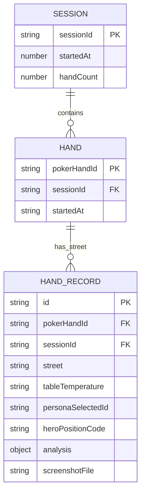

# feat: Track Hand Sessions and Advice Context for Improvement Loop

## Overview

The system already writes `HandRecord` JSON + PNG to disk when `SAVE_HANDS=true`, and `scripts/query-hands.ts` can query them. However, the records are **isolated snapshots** — there is no way to know which hands came from the same session, which multi-street records belong to the same poker hand, or what table state drove the AI's recommendation. This plan closes those gaps so each hand becomes a fully traceable, reviewable unit for iterative system improvement.

## Problem Statement

When reviewing `data/hands/` records you currently cannot answer:
- "What did Claude recommend across all streets of this specific hand?"
- "Which hands came from the same table session?"
- "What was the table temperature when Claude gave this advice?"
- "Which persona was auto-selected, and did it match Claude's recommendation?"
- "What was my position, and can I filter by it?"

All of these are key questions for tuning the system. The data exists transiently but is never stitched together at write time.

## Proposed Solution

Extend `HandRecord` with three new linkage fields and two new context fields, pass them through the existing capture→detect→analyze pipeline, and upgrade the query script to surface the improvement-relevant groupings.

### New Fields in `HandRecord`

```typescript
// lib/storage/hand-records.ts

interface HandRecord {
  // --- existing fields ---
  id: string;
  timestamp: string;
  captureMode: "manual" | "continuous";
  screenshotFile: string;
  detectedText: string | null;
  detectionDetails: DetectionDetail[];
  handContext: string | null;
  opponentHistory: Record<number, OpponentProfile> | null;
  systemPromptVariant: "standard" | "with-detected-cards";
  analysis: HandAnalysis;

  // --- NEW linkage fields ---
  sessionId: string;          // From PokerSession.id in sessionStorage
  pokerHandId: string;        // Groups PREFLOP→FLOP→TURN→RIVER for same hand
  street: Street;             // Structured enum, not just inferred from analysis

  // --- NEW context fields ---
  tableTemperature: "hot" | "warm" | "cool" | null;
  tableReads: number | null;  // How many opponents informed the temperature classification
  personaSelected: {
    personaId: string;
    action: string;           // e.g. "RAISE 3BB"
    temperature: "hot" | "warm" | "cool" | null;
  } | null;
  heroPositionCode: HeroPosition | null;  // Structured, not just text
}
```

### Data Model (Logical)



### Where Each Field Comes From

| Field | Source | When set |
|---|---|---|
| `sessionId` | `PokerSession.id` from sessionStorage | Read in `app/page.tsx` before POST to `/api/analyze` |
| `pokerHandId` | Generated UUID in hand state machine at WAITING→PREFLOP | Set in `useHandTracker` when new hand starts, passed via `onAnalysisTrigger` |
| `street` | `handState.currentStreet` at time of trigger | Passed alongside `handContext` |
| `tableTemperature` | `TableProfile.temperature` in `AnalysisResult.tsx` | Read from props before `useObject` fires |
| `tableReads` | `TableProfile.reads` (classified opponent count) | Same source as temperature, passed alongside it |
| `personaSelected` | Return value of `selectPersona()` called at PREFLOP | Captured in `usePersonaSelector` result, passed to trigger |
| `heroPositionCode` | `detectionResult.heroPosition` | Available in `useContinuousCapture`, add to trigger payload |

## Technical Considerations

### Minimal Surface Area

The pipeline already passes a `captureMetadata` bag from `onAnalysisTrigger` through to `writeHandRecord`. Adding fields here requires:
1. Extending the `AnalysisTriggerPayload` type
2. Extending the `HandRecord` type
3. Reading new values at the trigger site in `app/page.tsx` / `useContinuousCapture.ts`
4. Passing them through to `writeHandRecord()` in the API route

No new API routes. No new storage systems. No schema migrations.

### `pokerHandId` Lifecycle

The hand state machine already fires `HAND_COMPLETE` when it transitions back to WAITING. Generate a `pokerHandId` UUID on `HAND_START` (WAITING→PREFLOP) and attach it to the `HandState`. All analysis triggers within the same hand progression share this ID.

```typescript
// lib/hand-tracking/types.ts
interface HandState {
  // existing...
  pokerHandId: string | null; // null in WAITING state
}

// In reducer: HAND_START action
case "HAND_START":
  return { ...state, pokerHandId: crypto.randomUUID(), streets: [] };
```

### Manual Capture Mode

In manual mode there is no state machine — `pokerHandId` should still be generated per capture. Use `crypto.randomUUID()` inline at trigger time. Each manual capture is its own "hand" with a single street record.

### `sessionId` Source

`lib/storage/sessions.ts` already manages `PokerSession` in sessionStorage. Read `getOrCreateSession().id` in `app/page.tsx` at analysis trigger time and include it in the payload. No changes to the session module.

## Acceptance Criteria

- [x] `HandRecord` includes `sessionId`, `pokerHandId`, `street`, `tableTemperature`, `personaSelected`, `heroPositionCode`
- [x] All multi-street records for the same continuous-mode hand share the same `pokerHandId`
- [x] All hands from the same browser session share the same `sessionId`
- [x] Manual captures get a unique `pokerHandId` per capture
- [x] `scripts/query-hands.ts` can group and display by session and by hand (`--group-by-hand`)
- [x] Query output shows: session → hand → street progression with Claude's action at each street
- [x] Existing records without new fields degrade gracefully (fields are optional with `null` fallback)

## Implementation Plan

### Phase 1 — Type & Storage Layer (no UI)

**Files touched:**
- `lib/storage/hand-records.ts` — add new fields to `HandRecord` interface
- `lib/hand-tracking/types.ts` — add `pokerHandId` to `HandState`
- `lib/hand-tracking/reducer.ts` — generate `pokerHandId` on HAND_START action

### Phase 2 — Pipeline Wiring

**Files touched:**
- `lib/hand-tracking/use-hand-tracker.ts` — expose `pokerHandId` from state
- `hooks/use-continuous-capture.ts` — include `heroPositionCode` in trigger payload
- `app/page.tsx` — read `sessionId`, `pokerHandId`, `tableTemperature`, `personaSelected`; pass in `AnalysisTriggerPayload`
- `app/api/analyze/route.ts` — accept new fields from request body, pass to `writeHandRecord`
- `lib/storage/hand-records.ts` — write new fields to JSON

### Phase 3 — Query Script Upgrade

**Files touched:**
- `scripts/query-hands.ts` — add `--session <id>`, `--hand <id>` flags; add session-grouping summary mode

Example output goal:
```
Session abc123 (2026-02-23 14:30, 8 hands)
  Hand def456
    PREFLOP  BTN  hot    → RAISE 3BB  [HIGH]
    FLOP     BTN  hot    → BET 2/3pot [HIGH]
    TURN     BTN  hot    → BET pot    [MEDIUM]
  Hand ghi789
    PREFLOP  SB   warm   → FOLD       [HIGH]
```

## Files to Touch

```
lib/storage/hand-records.ts        — HandRecord type + writeHandRecord()
lib/hand-tracking/types.ts         — HandState type
lib/hand-tracking/reducer.ts       — pokerHandId generation on HAND_START
lib/hand-tracking/use-hand-tracker.ts — expose pokerHandId
hooks/use-continuous-capture.ts    — add heroPositionCode to trigger payload
app/page.tsx                       — assemble full AnalysisTriggerPayload
app/api/analyze/route.ts           — receive + forward new fields
scripts/query-hands.ts             — session + hand grouping
```

## Dependencies & Risks

- **Risk: `tableTemperature` prop not available at trigger site.** `TableProfile` is computed in `useContinuousCapture` / `app/page.tsx`. Verify it is in scope when `onAnalysisTrigger` fires and hasn't been cleared by a re-render. Mitigation: capture it in a ref alongside `imageBase64`.
- **Risk: `personaSelected` fires async after trigger.** `selectPersona()` runs at PREFLOP start. Verify the return value is stable by the time analysis fires (it should be — persona is selected before analysis is triggered). Mitigation: capture persona in `useRef` at selection time.
- **Backward compatibility:** Existing JSON records on disk have no new fields. `query-hands.ts` must handle `undefined` gracefully (treat as `null`).

## Success Metrics

After implementation, you should be able to run:
```bash
bun run scripts/query-hands.ts --group-by-hand
```
and see each poker hand with its full street-by-street advice progression, table temperature context, and persona alignment — ready for qualitative review and system tuning.

## References

### Internal
- `lib/storage/hand-records.ts` — `HandRecord` type and `writeHandRecord()`
- `lib/storage/sessions.ts` — `PokerSession` and `getOrCreateSession()`
- `lib/hand-tracking/types.ts` — `HandState`, `StreetSnapshot`, `Street`
- `lib/hand-tracking/reducer.ts` — state machine transitions
- `app/page.tsx` — where `onAnalysisTrigger` is assembled and called
- `app/api/analyze/route.ts` — where `writeHandRecord()` is called
- `scripts/query-hands.ts` — existing query tooling to extend
- `docs/solutions/implementation-patterns/continuous-capture-state-machine.md` — HAND_START / HAND_COMPLETE lifecycle
- `docs/solutions/logic-errors/continuous-capture-race-conditions.md` — use `submittedRef` pattern, capture atomically
